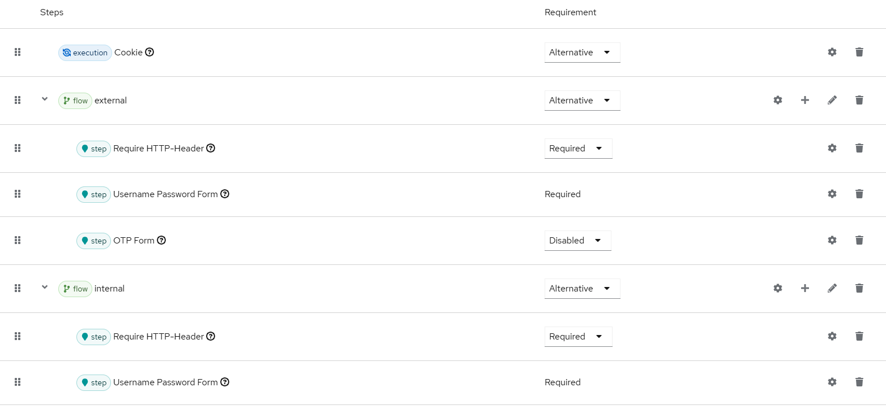
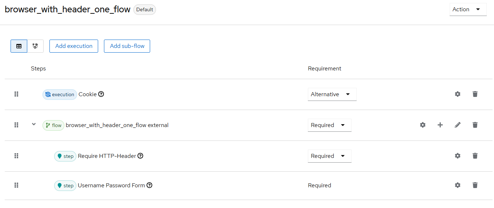

[open-issues]: https://github.com/it-at-m/keycloak-require-http-header-authenticator-plugin/issues
[new-issue]: https://github.com/it-at-m/keycloak-require-http-header-authenticator-plugin/issues/new/choose
[license]: ./LICENSE
[new-issue-shield]: https://img.shields.io/badge/new%20issue-blue?style=for-the-badge
[made-with-love-shield]: https://img.shields.io/badge/made%20with%20%E2%9D%A4%20by-it%40M-yellow?style=for-the-badge
[license-shield]: https://img.shields.io/github/license/it-at-m/refarch?style=for-the-badge
[itm-opensource]: https://opensource.muenchen.de/

# keycloak-require-http-header-authenticator-plugin

[![New issue][new-issue-shield]][new-issue]
[![Made with love by it@M][made-with-love-shield]][itm-opensource]
[![GitHub license][license-shield]][license]

Authenticator for evaluating an HTTP header and its value.

## Built With

- OpenJDK 21
- Keycloak 26

## Deploy

Copy the file `require-http-header-authenticator-X.X.X.jar` from the `target` directory
(which exists after the build process) into the KeyCloak directory `providers`.

## Configure

The following values are configurable:

* Header Name: The name of the header to be checked
* Header Value: The expected value of the header
* NEGATE-LOGIC: Invert checking logic, i.e. error if the header contains the expected value

## Test

Can be locally tested like this:

### Version 1 - Header set by proxy

* Create new realm `muenchen.de`
* Authentication
    * Flow "Browser" --> Dropdown "Action" --> Duplicate --> Name "browser_with_header"
    * Configure the flow like this: 
        * Subflow "external" --> execution "Require HTTP-Header" --> Settings
            * Alias: external
            * negate logic: Off
            * HTTP Header Name: X-LHM-Origin
            * HTTP Header Value: external
        * Subflow "internal" --> execution "Require HTTP-Header" --> Settings
            * Alias: internal
            * * negate logic: On
            * HTTP Header Name: X-LHM-Origin
            * HTTP Header Value: external
* Create user test with password test in same realm
* Login to account in realm `muenchen.de`, should work with password only
* Use a proxy to set the header X-LHM-Origin to `external` when calling Keycloak
* Login again, now the 2FA (via OTP) is active and will request a second factor

### Version 2 - Header set manually

* Like above, but only one subflow like this: * Subflow "external" --> execution "Require HTTP-Header" --> Settings
    * Alias: external
    * negate logic: Off
    * HTTP Header Name: X-LHM-Origin
    * HTTP Header Value: external
* With request tool like Bruno, send this request:
  `https://localhost:8443/auth/realms/muenchen.de/protocol/openid-connect/auth?client_id=account-console&redirect_uri=https%3A%2F%2Flocalhost%3A8443%2Fauth%2Frealms%2Fmuenchen.de%2Faccount&response_type=code&code_challenge=WLs5-39Xt_FMLLZyHs18bzag6zInEDt2rQ3GJd0vgLk&code_challenge_method=S256`
* Will return http-400 with error "Invalid username or password."
* Make same request, but this time add a header with key `X-LHM-Origin` and value `external`
* Will return http-200 with login page

## Roadmap

See the [open issues][open-issues] for a full list of proposed features (and known issues).

## Contributing

Contributions are what make the open source community such an amazing place to learn, inspire, and create. Any contributions you make are **greatly appreciated**.

If you have a suggestion that would make this better, please open an issue with the tag "enhancement", fork the repo and create a pull request. You can also simply open an issue with the tag "enhancement".
Don't forget to give the project a star! Thanks again!

1. Open an issue with the tag "enhancement"
2. Fork the Project
3. Create your Feature Branch (`git checkout -b feature/AmazingFeature`)
4. Commit your Changes (`git commit -m 'Add some AmazingFeature'`)
5. Push to the Branch (`git push origin feature/AmazingFeature`)
6. Open a Pull Request

More about this in the [CODE_OF_CONDUCT](./.github/CODE_OF_CONDUCT.md) file.

## License

Distributed under the MIT License. See [LICENSE](LICENSE) file for more information.

## Contact

it@M - <opensource@muenchen.de>
